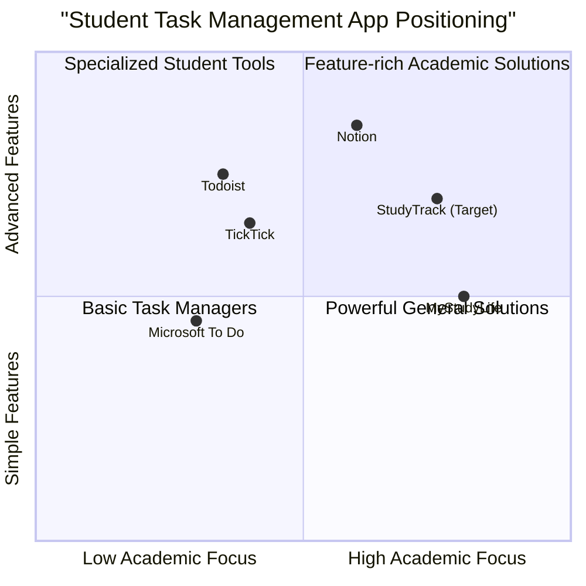

# Product Requirements Document: StudyTrack

## Table of Contents

1. [Introduction](#introduction)
2. [Product Overview](#product-overview)
3. [Market Research](#market-research)
4. [User Analysis](#user-analysis)
5. [Product Features](#product-features)
6. [User Stories](#user-stories)
7. [Requirements Specification](#requirements-specification)
8. [UI Design Guidelines](#ui-design-guidelines)
9. [Technical Considerations](#technical-considerations)
10. [Open Questions](#open-questions)

## Introduction

This document outlines the requirements for StudyTrack, a task management application specifically designed for students. The application aims to address the unique challenges faced by students in managing academic workloads, assignments, deadlines, and study schedules.

### Purpose

The purpose of this PRD is to define the features, functionality, and user experience of the StudyTrack application, serving as a guide for design and development teams.

### Project Scope

This project encompasses the design and documentation of a student-focused task management application that will help students organize their academic responsibilities effectively.

### Original Requirements

Create a comprehensive task management application tailored specifically for students to help them track assignments, manage deadlines, organize study schedules, and improve their overall academic productivity.

## Product Overview

### Product Definition

StudyTrack is a dedicated task management application designed to help students organize their academic workload, manage deadlines, track progress, and maintain a balanced study schedule. The application provides tools for prioritization, time management, and productivity tracking in an educational context.

### Product Goals

1. **Academic Organization**: Provide students with a comprehensive system to organize and track all academic tasks, assignments, and deadlines across multiple courses.
2. **Time Management Enhancement**: Help students develop better time management skills through effective scheduling, reminders, and progress tracking.
3. **Study Productivity Improvement**: Increase student productivity through focus features, study analytics, and motivation mechanisms.

### Target Audience

The primary target audience is students across different educational levels:

- College/university students
- High school students
- Graduate students
- Adult learners in continuing education

## Market Research

### Competitive Analysis

#### 1. Todoist

**Pros:**

- Excellent natural language processing for quick task entry
- Cross-platform availability
- Robust organization with projects, labels, filters, and priorities
- Clean and intuitive interface

**Cons:**

- Not specifically designed for academic contexts
- Advanced features require paid subscription ($36/year)
- Windows app less refined than Mac version
- Limited educational-specific features

#### 2. TickTick

**Pros:**

- More affordable than similar options ($27.99/year)
- Built-in Pomodoro timer
- Integrated calendar view
- Cross-platform compatibility

**Cons:**

- Interface closely mimics competitors
- Occasional syncing issues reported
- Limited academic-specific categorization

#### 3. Microsoft To Do

**Pros:**

- Excellent Office 365 integration
- Simple, clean interface
- Strong collaboration features
- Free with Microsoft account

**Cons:**

- Less feature-rich than specialized task managers
- Limited customization options
- No specific academic features

#### 4. Notion

**Pros:**

- All-in-one workspace combining tasks, notes, and organization
- Highly customizable dashboards
- Capable of complex academic organization
- Approximately 20 million users globally

**Cons:**

- Steeper learning curve
- Can be overwhelming for beginners
- May feel excessive for simple task management

#### 5. MyStudyLife

**Pros:**

- Specifically designed for students
- Efficient class scheduling and assignment tracking
- Education-focused interface
- Dedicated academic features

**Cons:**

- Limited use beyond academic context
- Fewer integration options than general-purpose apps
- Less robust task management compared to dedicated task apps

### Competitive Quadrant Chart

### Market Gaps and Opportunities

1. **Academic Integration Gap**: Most existing solutions lack deep integration with academic workflows and learning management systems.
2. **Balance Between Simplicity and Power**: Many apps are either too simple or too complex, with few options balancing ease of use with academic-specific power features.
3. **Motivation and Engagement**: Limited implementation of effective gamification or motivation techniques specifically designed for academic contexts.
4. **Learning Style Adaptation**: Existing solutions rarely account for different learning styles and study preferences.
5. **Academic Analytics**: Few solutions provide meaningful insights into study habits, productivity patterns, and academic performance correlation.

## User Analysis

### Student Challenges

1. **Time Management Struggles**: 78% of students report difficulties with time management, with procrastination being the primary challenge.
2. **Overwhelming Workloads**: Balancing multiple courses, each with different assignment structures and deadlines.
3. **Digital Distractions**: Difficulty maintaining focus while using digital tools for studying.
4. **Mental Health Impact**: Nearly 60% of college students experience anxiety and depression related to academic demands.
5. **Task Prioritization**: Difficulty determining which tasks have the highest academic impact.

### Student Needs

1. **Unified Organization System**: A single tool to track assignments across multiple courses.
2. **Visual Task Organization**: Methods to visualize workloads and deadlines.
3. **Deadline Management**: Clear tracking and reminders for approaching due dates.
4. **Time Allocation Tools**: Features to block out study time and create structured schedules.
5. **Prioritization Methods**: Systems to categorize tasks by importance and urgency.
6. **Focus Enhancement**: Tools to maintain concentration during study sessions.
7. **Self-Care Integration**: Features that encourage breaks and prevent burnout.

### User Segments

1. **Highly Organized Planners**: Students who thrive on detailed scheduling and organization.
2. **Last-Minute Managers**: Students who tend to work close to deadlines and need strong reminder systems.
3. **Visual Learners**: Students who benefit from visual representations of tasks and schedules.
4. **Collaborative Students**: Students who frequently work on group projects and need shared task management.
5. **Multi-tasking Students**: Students balancing academics with work or extracurricular activities.

## Product Features

### Core Features

1. **Task Management**

   - Task creation with academic context (course, assignment type, weight)
   - Deadline setting and tracking
   - Priority levels and importance markers
   - Task categories and tags
   - Subtask creation and management

2. **Academic Calendar**

   - Course schedule integration
   - Assignment deadline visualization
   - Exam and important date tracking
   - Time blocking for study sessions

3. **Smart Prioritization**

   - Assignment weight consideration
   - Due date proximity alerts
   - Effort estimation tools
   - Academic impact scoring

4. **Focus Mode**

   - Pomodoro timer integration
   - Distraction blocking
   - Study session tracking
   - Break reminders

5. **Progress Analytics**
   - Task completion metrics
   - Course workload visualization
   - Productivity pattern analysis
   - Study time tracking

### Secondary Features

6. **Gamification Elements**

   - Achievement badges for academic milestones
   - Streak tracking for consistent study habits
   - Points system for completed tasks
   - Level progression based on academic productivity

7. **Collaboration Tools**

   - Group project task sharing
   - Collaborative assignment tracking
   - Shared study session scheduling

8. **Content Organization**

   - File attachment to tasks
   - Note-taking linked to assignments
   - Resource tagging and organization

9. **Notification System**

   - Smart reminders based on task importance
   - Customizable alert schedules
   - Progressive deadline warnings

10. **Personalization**
    - Multiple view options (list, board, calendar)
    - Color coding by course or category
    - Custom filters and saved searches
    - Theme options including dark mode

## User Stories

### User Story 1: Task Organization

As a college student managing multiple courses, I want to easily create and organize tasks by course, deadline, and priority so that I can clearly see what needs to be done across all my classes and avoid missing important deadlines.

**Acceptance Criteria:**

- Tasks can be created with course designation
- Multiple sorting options available (deadline, priority, course)
- Visual indicators show task priority and due date proximity
- Tasks can be viewed in list, board, or calendar format

### User Story 2: Productive Study Sessions

As a student easily distracted by social media, I want focus mode features that help me concentrate on my studies so that I can complete assignments more efficiently and improve my learning outcomes.

**Acceptance Criteria:**

- Pomodoro timer with customizable work/break intervals
- Study session tracking with productivity metrics
- Optional distraction blocking during focus sessions
- Break reminders to prevent burnout

### User Story 3: Assignment Prioritization

As a student with varying assignment weights across courses, I want a prioritization system that considers both deadlines and academic impact so that I can focus on the most important tasks first.

**Acceptance Criteria:**

- Ability to assign weight/importance to tasks
- Smart sorting algorithm that balances due dates with task importance
- Visual dashboard showing highest priority items
- Quick filters for "Do Now" vs "Do Later" tasks

### User Story 4: Group Project Coordination

As a student working on multiple group projects, I want collaborative task management features so that I can coordinate deadlines and responsibilities with team members efficiently.

**Acceptance Criteria:**

- Tasks can be shared with group members
- Progress updates visible to all team members
- Assignment of subtasks to specific individuals
- Communication thread attached to collaborative tasks

### User Story 5: Academic Performance Insights

As a student trying to improve study habits, I want analytics on my task completion patterns and study productivity so that I can identify areas for improvement and track my progress over time.

**Acceptance Criteria:**

- Dashboard showing task completion rates
- Study time analytics broken down by course
- Historical trends in productivity and procrastination
- Actionable insights based on performance data

## Requirements Specification

### Requirements Pool

#### P0 (Must-Have) Requirements

1. **Task Creation and Management**

   - Users must be able to create tasks with title, description, due date, and course
   - Users must be able to mark tasks as complete
   - Users must be able to edit and delete tasks
   - Users must be able to view tasks in list and calendar views

2. **Academic Organization**

   - Users must be able to categorize tasks by course
   - Users must be able to assign priority levels to tasks
   - Users must be able to set deadlines with reminders
   - Users must be able to see upcoming deadlines in chronological order

3. **Basic Calendar**

   - Users must be able to view tasks on a calendar interface
   - Users must be able to see course schedule on calendar
   - Calendar must visually distinguish different task types and priorities
   - Users must be able to navigate between days, weeks, and months

4. **Notifications and Reminders**

   - Users must receive notifications for upcoming deadlines
   - Users must be able to customize notification timing
   - System must provide escalating reminders as deadlines approach
   - Users must be able to enable/disable notifications

5. **Cross-Platform Synchronization**
   - User data must sync across devices (mobile and web)
   - Changes must update in real-time across all platforms
   - Users must be able to access their tasks offline with sync on reconnection

#### P1 (Should-Have) Requirements

6. **Focus Mode and Pomodoro Timer**

   - Users should be able to start focused study sessions
   - System should include customizable Pomodoro timer
   - Users should be able to track study session duration and breaks
   - System should provide focus statistics after sessions

7. **Gamification Elements**

   - Users should earn achievement badges for completing tasks
   - System should track streaks for consistent task completion
   - Users should gain points or levels for academic productivity
   - Users should have a visual representation of progress

8. **Progress Analytics**

   - System should display task completion rates by course
   - Users should be able to view productivity trends over time
   - System should provide insights on study habits
   - Users should be able to export or share progress reports

9. **Collaboration Features**

   - Users should be able to share tasks with peers
   - System should allow assignment of tasks to group members
   - Users should be able to comment on shared tasks
   - System should notify all members of updates to shared tasks

10. **Advanced Prioritization**
    - System should suggest task priority based on deadline and weight
    - Users should be able to view tasks sorted by academic impact
    - System should provide a "Do Next" recommendation
    - Users should be able to create custom priority filters

#### P2 (Nice-to-Have) Requirements

11. **Learning Management System Integration**

    - System may integrate with popular LMS platforms (Canvas, Blackboard)
    - Users may import assignments and deadlines automatically
    - System may sync submission status with LMS
    - Grade tracking may be incorporated with task completion

12. **AI Study Recommendations**

    - System may analyze productivity patterns to suggest optimal study times
    - Users may receive personalized recommendations for task scheduling
    - System may adapt to user's learning style over time
    - AI may suggest task breakdown for complex projects

13. **Social Features**

    - Users may optionally connect with classmates
    - System may enable creation of study groups
    - Users may share study schedules for coordinated sessions
    - System may include accountability partnerships

14. **Resource Management**

    - Users may attach files and references to tasks
    - System may organize study materials by course and topic
    - Users may share resources with study groups
    - System may suggest relevant resources based on tasks

15. **Advanced Customization**
    - Users may create custom views and dashboard layouts
    - System may offer extensive theme options including dark mode
    - Users may create templates for recurring assignment types
    - System may allow for custom tagging and categorization systems

## UI Design Guidelines

### Design Principles

1. **Simplicity**: Clean interface with minimal clutter to reduce cognitive load
2. **Hierarchy**: Clear visual hierarchy highlighting important tasks and deadlines
3. **Consistency**: Uniform design language throughout the application
4. **Accessibility**: Inclusive design accommodating various user needs
5. **Engagement**: Visually appealing elements that motivate continued use

### UI Components

#### Home Dashboard

- Quick view of today's tasks and upcoming deadlines
- Progress summary with visual indicators
- Quick-add task button
- Navigation to key features

#### Task Views

- List view with sorting and filtering options
- Board view with task status columns
- Calendar view showing tasks by date
- Course view grouping tasks by class

#### Task Cards

- Clear display of task name, course, and deadline
- Visual priority indicators
- Progress status for multi-step tasks
- Quick actions (complete, edit, delete)

#### Calendar Interface

- Month, week, and day views
- Color coding by course
- Visual distinction between classes, assignments, and exams
- Time blocking for study sessions

#### Focus Mode

- Distraction-free interface
- Prominent timer display
- Current task highlight
- Break indicators

### Visual Elements

1. **Color Scheme**

   - Primary palette using calm, focus-enhancing colors
   - Course color coding system
   - Priority level color indicators (red, yellow, green)
   - Optional dark mode for night studying

2. **Typography**

   - Clean, readable sans-serif fonts
   - Clear hierarchy through font weights and sizes
   - Consistent text styling throughout the application

3. **Iconography**

   - Intuitive, recognizable icons for common actions
   - Consistent icon style and sizing
   - Visual task type indicators

4. **Responsive Design**
   - Adaptable layouts for mobile, tablet, and desktop
   - Touch-friendly interaction on mobile devices
   - Consistent experience across device sizes

### UX Considerations

1. **Onboarding**

   - Guided tour highlighting key features
   - Course setup wizard for first-time users
   - Sample tasks demonstrating functionality

2. **Notifications**

   - Non-intrusive but effective alert system
   - Progressive reminder escalation
   - Customizable notification preferences

3. **Navigation**

   - Intuitive main navigation menu
   - Quick access to frequently used features
   - Consistent back navigation

4. **Feedback**

   - Visual confirmation of actions
   - Progress indicators for loading states
   - Error messages with clear resolution paths

5. **Microinteractions**
   - Satisfying task completion animations
   - Subtle hover states and transitions
   - Interactive elements that respond to user actions

## Technical Considerations

### Platform Requirements

1. **Web Application**

   - Modern browsers (Chrome, Firefox, Safari, Edge)
   - Responsive design for desktop and mobile viewing
   - Progressive Web App capabilities for offline access

2. **Mobile Applications**
   - Native iOS application (iOS 14+)
   - Native Android application (Android 8.0+)
   - Consistent feature parity across platforms

### Integration Points

1. **Calendar Services**

   - Google Calendar
   - Apple Calendar
   - Microsoft Outlook

2. **Cloud Storage**

   - Google Drive
   - Dropbox
   - OneDrive

3. **Learning Management Systems**
   - Canvas
   - Blackboard
   - Moodle

### Data Considerations

1. **User Data**

   - Academic profile and preferences
   - Course information
   - Task and deadline data
   - Study analytics and progress metrics

2. **Security Requirements**

   - End-to-end encryption for user data
   - Secure authentication methods
   - Privacy-focused design philosophy
   - Compliance with educational data protection standards

3. **Performance Expectations**
   - Fast task creation and management
   - Efficient synchronization across devices
   - Minimal loading times for calendar and task views
   - Smooth transitions and animations

## Open Questions

1. **Integration Depth**

   - How deeply should the application integrate with existing Learning Management Systems?
   - Should the app offer two-way synchronization with LMS platforms or one-way imports?

2. **Social Features Scope**

   - What level of social and collaborative features would provide value without creating privacy concerns?
   - Should collaboration be limited to specific tasks or extend to study groups?

3. **Gamification Balance**

   - How can gamification elements motivate without becoming distracting?
   - What types of rewards are most meaningful in an academic context?

4. **Analytics Privacy**

   - What level of study habit analytics would students find helpful versus invasive?
   - Should analytics be shareable with academic advisors or instructors?

5. **Monetization Approach**
   - Should the application use a freemium model with core features free and advanced features paid?
   - What features would students be willing to pay for?
   - Are educational institution partnerships a viable revenue stream?

## Wireframe Guidelines

The following section provides guidance for creating wireframes based on this PRD. These wireframes would need to be developed in Figma or similar tools for the final submission.

### Key Screens to Include

#### 1. Dashboard/Home Screen

- Task overview section showing today's and upcoming tasks
- Progress visualization (weekly/monthly completion rates)
- Quick-add task button prominently displayed
- Course summary with color coding
- Navigation menu for other sections

#### 2. Task List View

- Filterable and sortable list of all tasks
- Clear visualization of deadlines, priorities, and courses
- Batch action capabilities (mark multiple as complete)
- Search functionality
- Various view options (by date, course, priority)

#### 3. Calendar View

- Monthly/weekly/daily toggle options
- Color-coded tasks by course
- Time blocking visualization for study sessions
- Drag-and-drop task rescheduling
- Quick-add functionality from calendar interface

#### 4. Task Detail Screen

- Comprehensive task information
- Due date with countdown
- Course association
- Priority level
- Description area
- Subtasks checklist
- File attachment area
- Related tasks section

#### 5. Focus Mode

- Minimal interface showing only current task
- Prominent Pomodoro timer
- Break indicators
- Session statistics
- Distraction blocking toggle

#### 6. Analytics Dashboard

- Productivity trends over time
- Course workload comparison
- Task completion rates
- Study session statistics
- Actionable insights based on data

#### 7. Course Management

- Course list with color coding
- Schedule information
- Assignment types
- Instructor information
- Grade tracking (optional)

### Interactive Elements

- Task completion checkboxes
- Priority level selectors
- Date pickers
- Drop-down menus for filtering
- Toggle switches for features
- Slide-out navigation panel
- Modal dialogs for task creation/editing
- Progress indicators
- Notification badges

### Navigation Structure

- Bottom navigation bar on mobile (Home, Tasks, Calendar, Focus)
- Sidebar navigation on desktop/tablet
- Consistent back button placement
- Quick actions accessible from main screens
- Search accessible from all screens

### Device-Specific Considerations

**Mobile Design:**

- Touch-friendly tap targets
- Bottom navigation for thumb accessibility
- Collapsible sections to save screen space
- Swipe gestures for common actions

**Tablet/Desktop Design:**

- Multi-column layouts for better information density
- Sidebar navigation
- Keyboard shortcuts
- Drag-and-drop functionality
- Split-screen views

These wireframe guidelines should inform the visual design of the application while ensuring that all core functionality described in the PRD is represented in the user interface.
